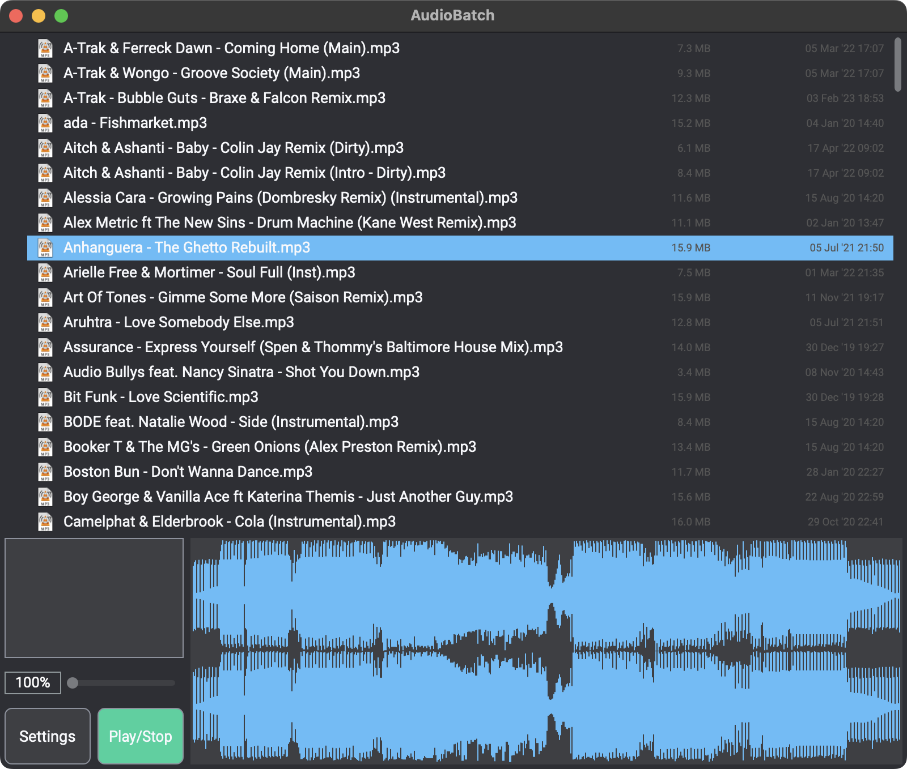

# AudioBatch

GUI and CLI tools (C++23 and JUCE) for analyzing audio files and preparing batch work.

Current implementation focus:

- Analyze audio files and calculate decoded sample peak values.
- Cache analysis results in SQLite so unchanged files are not re-read every run.
- Show sortable peak data in the GUI.
- Show per-file processing state directly in the results list while background work is running.
- Normalize selected files to `0 dBFS` peak from the GUI.
- Run the same analysis from a console executable.



## Dependencies

- [JUCE](https://juce.com/)
- CMake
- SQLite 3

`SQLite3` is resolved through CMake.
If a system `SQLite3` package is available it will be used,
otherwise CMake falls back to fetching the SQLite amalgamation.

MP3 normalization requires a working `lame` encoder executable to be installed and available to the app.

Install `lame` with your platform package manager:

Windows:

```powershell
scoop install main/lame
```

macOS:

```shell
brew install lame
```

## Build

For routine development checks, use the CMake presets so you reuse the same build directories as the editor or IDE.

Windows debug with the Visual Studio generator:

```powershell
cmake --preset windows-debug
cmake --build --preset windows-debug
```

Windows debug with Ninja and MSVC, which also produces `compile_commands.json`:

```powershell
cmake --preset windows-ninja-debug
cmake --build --preset windows-ninja-debug
```

macOS debug:

```shell
cmake --preset macos-debug
cmake --build --preset macos-debug
```

`build.sh` is intended for release builds and requires Bash (use Git Bash on Windows):

```shell
./build.sh -b Release
```

This produces two binaries:

- `AudioBatchApp` for the GUI.
- `audiobatch` for terminal analysis.

## GUI

The GUI analyzes the selected root folder automatically in the background and stores results in a sortable table.

The results list supports per-file actions from the context menu, including:

- reveal file in Finder or Explorer
- open the parent folder
- move files to the system trash
- normalize selected files to `0 dBFS` peak

MP3 files can only be normalized when `lame` is installed. AIFF, WAV, and other formats continue to depend on the
writers available in the current JUCE build.

The status column also shows per-file activity while analysis or normalization is running.

Visible columns:

- file name
- full path
- file type
- peak L
- peak R
- peak max
- status

Default sorting is by overall peak ascending, so the quietest files appear first.

## CLI

The console executable supports both short and long option forms.

```text
audiobatch [options] <paths...>

  -h, --help
  -V, --version
  -c, --cli
  -H, --headless
  -r, --recurse
  -f, --refresh
  -j, --jobs <count>
  -s, --sort <peak|name|path>
```

Examples:

```shell
audiobatch "music/song.wav"
audiobatch -r -s name "music/library"
audiobatch --recurse --sort peak "music/library"
```

Default CLI output format:

```text
<peak>  <audio filename>
```

Example output:

```text
 -20.48 dBFS  audiofile.wav
```

## Cache

Analysis results are cached in a SQLite database located under the user application data directory in an `AudioBatch/analysis.db` file.

The cache is invalidated when any of these change:

- file path
- file size
- file modification time
- internal analysis schema version

## TODO

Not implemented yet:

- loudness analysis using <https://github.com/jiixyj/libebur128>
- true peak analysis
- VST batch processing
